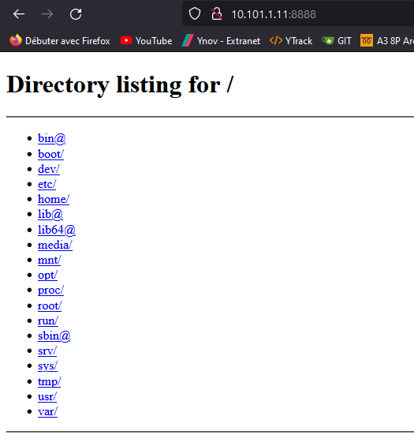

# TP1 : (re)Familiaration avec un système GNU/Linux

- **un accès internet (via la carte NAT)**
- **carte réseau dédiée**


```
[gaetan@node1 ~]$ ping 8.8.8.8
PING 8.8.8.8 (8.8.8.8) 56(84) bytes of data.
64 bytes from 8.8.8.8: icmp_seq=1 ttl=113 time=19.1 ms
64 bytes from 8.8.8.8: icmp_seq=2 ttl=113 time=20.1 ms
```


- **route par défaut**

```
[gaetan@node1 ~]$ ip route show
default via 10.0.2.2 dev enp0s3 proto dhcp metric 100
10.0.2.0/24 dev enp0s3 proto kernel scope link src 10.0.2.15 metric 100
10.101.1.0/24 dev enp0s8 proto kernel scope link src 10.101.1.11 metric 101
```


- **un accès à un réseau local (les deux machines peuvent se ping) (via la carte Host-Only)**

```
[gaetan@node1 ~]$ ping 10.101.1.12
PING 10.101.1.12 (10.101.1.12) 56(84) bytes of data.
64 bytes from 10.101.1.12: icmp_seq=1 ttl=64 time=1.56 ms
64 bytes from 10.101.1.12: icmp_seq=2 ttl=64 time=0.940 ms
```


- **carte réseau dédiée (host-only sur VirtualBox)**
`ip a`

- **les machines doivent posséder une IP statique sur l'interface host-only**


```
capTYPE=Ethernet
BOOTPROTO=static
DEFROUTE=yes
IPADDR=10.101.1.11
NETMASK=255.255.255.0
NAME=enp0s8
DEVICE=enp0s8
ONBOOT=yes
```


- **les machines doivent avoir un nom
    /etc/hostname
    commande hostname**
    ```sudo nano /etc/hostname
    node1.tp1.b2```
    


- **utiliser 1.1.1.1 comme serveur DNS**
``sudo cat /etc/resolv.conf
nameserver 1.1.1.1``


- **vérifier avec le bon fonctionnement avec la commande dig**

```
[gaetan@node1 ~]$ dig

; <<>> DiG 9.11.26-RedHat-9.11.26-4.el8_4 <<>>
;; global options: +cmd
;; Got answer:
;; ->>HEADER<<- opcode: QUERY, status: NOERROR, id: 46105
;; flags: qr rd ra; QUERY: 1, ANSWER: 13, AUTHORITY: 0, ADDITIONAL: 27

;; OPT PSEUDOSECTION:
; EDNS: version: 0, flags:; udp: 1232
; COOKIE: 36d5c809365ff9caff69b4a1614d71803df38a0220157447 (good)
;; QUESTION SECTION:
;.                              IN      NS

;; ANSWER SECTION:
.                       441280  IN      NS      b.root-servers.net.
.                       441280  IN      NS      g.root-servers.net.
.                       441280  IN      NS      i.root-servers.net.
...........................

;; ADDITIONAL SECTION:
a.root-servers.net.     527770  IN      A       198.41.0.4
b.root-servers.net.     530689  IN      A       199.9.14.201
c.root-servers.net.     558065  IN      A       192.33.4.12
d.root-servers.net.     573872  IN      A       199.7.91.13
.............................

;; Query time: 21 msec
;; SERVER: 192.168.1.1#53(192.168.1.1)
;; WHEN: Fri Sep 24 08:34:38 CEST 2021
;; MSG SIZE  rcvd: 839
```


- **avec dig, demander une résolution du nom ynov.com**

```
[gaetan@node1 ~]$ dig ynov.com


; <<>> DiG 9.11.26-RedHat-9.11.26-4.el8_4 <<>> ynov.com
;; global options: +cmd
;; Got answer:
;; ->>HEADER<<- opcode: QUERY, status: NOERROR, id: 43270
;; flags: qr rd ra; QUERY: 1, ANSWER: 1, AUTHORITY: 0, ADDITIONAL: 1

;; OPT PSEUDOSECTION:
; EDNS: version: 0, flags:; udp: 1232
; COOKIE: 3e3420e5dd7fa1934fc80f93614d716015c49f0ccc3a42fb (good)
;; QUESTION SECTION:
;ynov.com.                      IN      A

;; ANSWER SECTION:
ynov.com.               10800   IN      A       92.243.16.143

;; Query time: 60 msec
;; SERVER: 192.168.1.1#53(192.168.1.1)
;; WHEN: Fri Sep 24 08:34:05 CEST 2021
;; MSG SIZE  rcvd: 81
```


- **mettre en évidence la ligne qui contient la réponse : l'IP qui correspond au nom demandé**

```
;; ANSWER SECTION:
ynov.com.               10800   IN      A       92.243.16.143
```


- **mettre en évidence la ligne qui contient l'adresse IP du serveur qui vous a répondu**


```
;; SERVER: 192.168.1.1#53(192.168.1.1)
```


- **les machines doivent pouvoir se joindre par leurs noms respectifs
    fichier /etc/hosts**
    
```
[gaetan@node1 ~]$ ping node2.tp1.b2
PING node2.tp1.b2 (10.101.1.12) 56(84) bytes of data.
64 bytes from node2.tp1.b2 (10.101.1.12): icmp_seq=1 ttl=64 time=0.891 ms
64 bytes from node2.tp1.b2 (10.101.1.12): icmp_seq=2 ttl=64 time=0.845 ms
```

```
[gaetan@node2 ~]$ ping node1.tp1.b2
PING node1.tp1.b2 (10.101.1.11) 56(84) bytes of data.
64 bytes from node1.tp1.b2 (10.101.1.11): icmp_seq=1 ttl=64 time=0.652 ms
64 bytes from node1.tp1.b2 (10.101.1.11): icmp_seq=2 ttl=64 time=0.682 ms
```

- **un utilisateur administrateur est créé sur les deux machines (il peut exécuter des commandes sudo en tant que root)**

```
[gaetan@node2 ~]$ groups
gaetan wheel admins
```


- **création d'un user modification de la conf sudo**
    
`useradd gaetan`


## I. Utilisateurs

### 1. Création et configuration

- 🌞 Ajouter un utilisateur à la machine, qui sera dédié à son administration. Précisez des options sur la commande d'ajout pour que ;
- le répertoire home de l'utilisateur soit précisé explicitement, et se trouve dans `/home`
- le shell de l'utilisateur soit `/bin/bash`

`useradd toto -m -s /bin/sh -u 2000`

- 🌞 Créer un nouveau groupe `admins` qui contiendra les utilisateurs de la machine ayant accès aux droits de `root` *via* la commande `sudo`.

```
## Allows people in group admins to run all commands
%admins  ALL=(ALL)       ALL
```

- 🌞 Ajouter votre utilisateur à ce groupe `admins`.

```
usermod -aG admins toto
usermod -aG admins gaetan
```


### 2. SSH
- il faut générer une clé sur le poste client de l'administrateur qui se connectera à distance (vous :) )

`  ssh-keygen -t rsa -b 4096`

` cat \Users\gaeta/.ssh/id_rsa.pub.`

- déposer la clé dans le fichier `/home/<USER>/.ssh/authorized_keys` de la machine que l'on souhaite administrer

`home/gaetan/.ssh/authorized_keys`


- 🌞 Assurez vous que la connexion SSH est fonctionnelle, sans avoir besoin de mot de passe.

```
PS C:\Users\gaeta> ssh gaetan@10.101.1.12
Activate the web console with: systemctl enable --now cockpit.socket

Last login: Wed Sep 22 17:21:14 2021 from 10.101.1.1
Activate the web console with: systemctl enable --now cockpit.socket

Last login: Wed Sep 22 17:21:14 2021 from 10.101.1.1
[gaetan@node2 ~]$
```


## II. Partitionnement

### 1. Préparation de la VM

- Ajout de deux disques durs à la machine virtuelle, de 3Go chacun.

`Dans virtualBox`

### 2. Partitionnement

- 🌞 Utilisez LVM pour :


- agréger les deux disques en un seul *volume group*

`sudo vgextend data /dev/sdb`

`sudo vgextend data /dev/sdc`


- créer 3 *logical volumes* de 1 Go chacun

`sudo lvcreate -L 1G data -n volume_1`

`sudo lvcreate -L 1G data -n volume_2`

`sudo lvcreate -L 1G data -n volume_3`

- formater ces partitions en `ext4`

`sudo mkfs -t ext4 /dev/data/volume_1`

`sudo mkfs -t ext4 /dev/data/volume_2`

`sudo mkfs -t ext4 /dev/data/volume_3`


- monter ces partitions pour qu'elles soient accessibles aux points de montage `/mnt/part1`, `/mnt/part2` et `/mnt/part3`.

`sudo mount /dev/data/volume_1 /mnt/part1`

`sudo mount /dev/data/volume_2 /mnt/part2`

`sudo mount /dev/data/volume_3 /mnt/part3`

- 🌞 Grâce au fichier `/etc/fstab`, faites en sorte que cette partition soit montée automatiquement au démarrage du système.

`vim /etc/fstab`

```
/dev/data/volume_1 /mnt/part1 ext4 defaults 0 0
/dev/data/volume_2 /mnt/part2 ext4 defaults 0 0
/dev/data/volume_3 /mnt/part3 ext4 defaults 0 0
```

## III. Gestion de services

## 1. Interaction avec un service existant

- Parmi les services système déjà installés sur CentOS, il existe `firewalld`. Cet utilitaire est l'outil de firewalling de CentOS.

- 🌞 Assurez-vous que :

- l'unité est démarrée
- l'unitée est activée (elle se lance automatiquement au démarrage)

```
systemctl status firewalld
● firewalld.service - firewalld - dynamic firewall daemon
   Loaded: loaded (/usr/lib/systemd/system/firewalld.service; enabled; vendor preset: enabled)
   Active: active (running) since Thu 2021-09-23 10:18:27 CEST; 50min ago
     Docs: man:firewalld(1)
 Main PID: 831 (firewalld)
    Tasks: 2 (limit: 11397)
   Memory: 30.4M
   CGroup: /system.slice/firewalld.service
           └─831 /usr/libexec/platform-python -s /usr/sbin/firewalld --nofork --nopid
```

## 2. Création de service

### A. Unité simpliste

- 🌞 Créer un fichier qui définit une unité de service `web.service` dans le répertoire `/etc/systemd/system`.

`cd /etc/systemd/system`

`touch web.service`

`sudo nano web.service`

- Le but de cette unité est de lancer un serveur web sur le port 8888 de la machine. **N'oubliez pas d'[ouvrir ce port](../../cours/memo/rocky_network.md#interagir-avec-le-firewall).**


`sudo firewall-cmd --add-port=8888/tcp --permanent`

`sudo firewall-cmd --reload`


- Une fois l'unité de service créée, il faut demander à *systemd* de relire les fichiers de configuration :

```bash
$ sudo systemctl daemon-reload
```

- Enfin, on peut interagir avec notre unité :

```
sudo systemctl status web
● web.service - Very simple web service
   Loaded: loaded (/etc/systemd/system/web.service; disabled; vendor preset: disabled)
   Active: inactive (dead)
```

```
sudo systemctl start web
[gaetan@node1 ~]$ sudo systemctl enable web
Created symlink /etc/systemd/system/multi-user.target.wants/web.service → /etc/systemd/system/web.service.
```
```
 sudo systemctl status web
[sudo] password for gaetan:
● web.service - Very simple web service
   Loaded: loaded (/etc/systemd/system/web.service; enabled; vendor preset: disabled)
   Active: active (running) since Thu 2021-09-23 11:36:25 CEST; 20s ago
 Main PID: 878 (python3)
    Tasks: 1 (limit: 11397)
   Memory: 13.6M
   CGroup: /system.slice/web.service
           └─878 /bin/python3 -m http.server 8888
```


- 🌞Une fois le service démarré, assurez-vous que pouvez accéder au serveur web : avec un navigateur ou la commande curl sur l'IP de la VM, port 8888.





### B. Modification de l'unité

- 🌞 Créer un utilisateur `web`.

`sudo useradd web`

- 🌞 Modifiez l'unité de service `web.service` créée précédemment en ajoutant les clauses :


- `User=` afin de lancer le serveur avec l'utilisateur `web` dédié
- `WorkingDirectory=` afin de lancer le serveur depuis un dossier spécifique, choisissez un dossier que vous avez créé dans `/srv`.
- ces deux clauses sont à positionner dans la section `[Service]` de votre unité

```
[Unit]
Description=Very simple web service

[Service]
ExecStart=/bin/python3 -m http.server 8888
User=web
WorkingDirectory=/srv/web
[Install]
WantedBy=multi-user.target
```


- 🌞 Placer un fichier de votre choix dans le dossier créé dans `/srv` et tester que vous pouvez y accéder une fois le service actif. Il faudra que le dossier et le fichier qu'il contient appartiennent à l'utilisateur `web`.

`cd /srv/web`

```
nano test.txt
```


- 🌞 Vérifier le bon fonctionnement avec une commande `curl`

```
[gaetan@node1 ~]$ curl 10.101.1.11:8888/srv/web/test.txt
Salut j'ai finis le tp ;)
```
